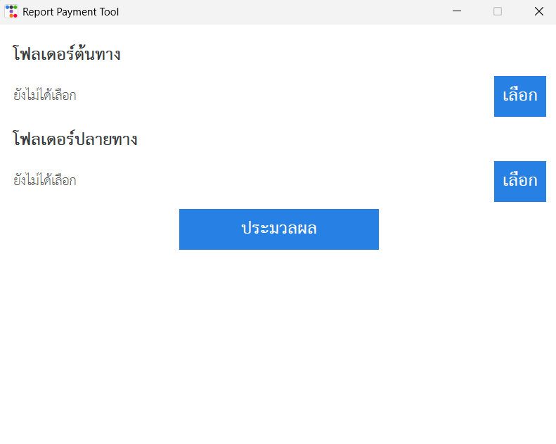
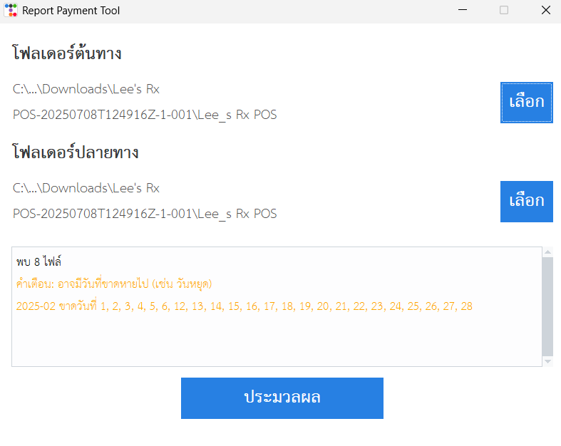
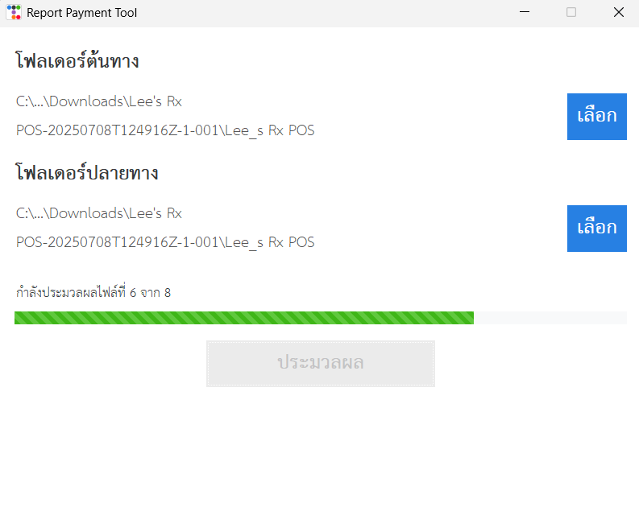
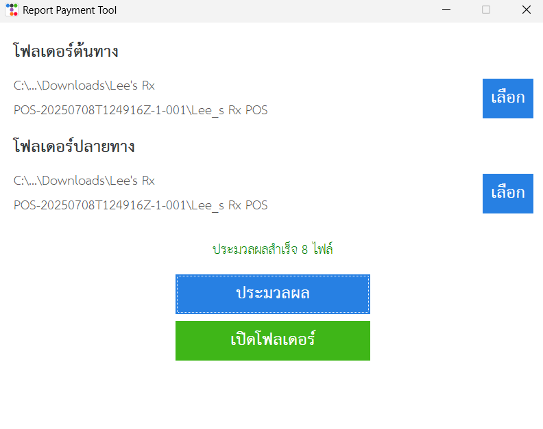
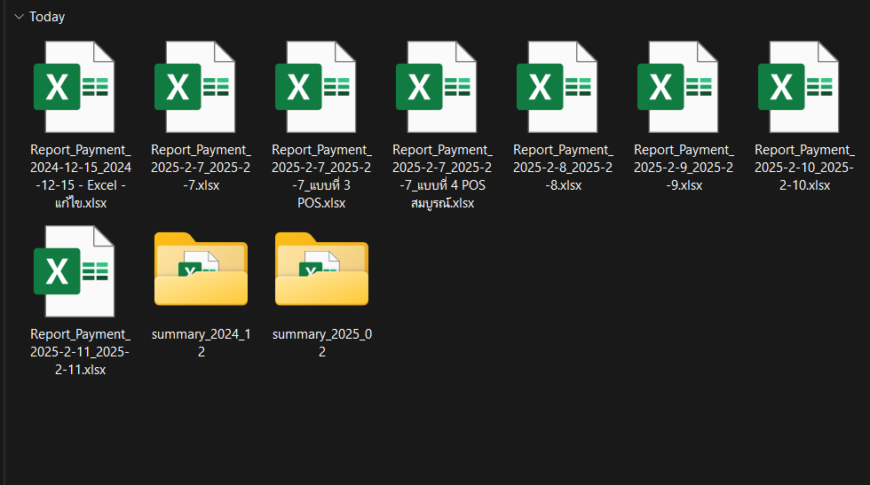

# 🧾 Report Payment Tool

**Report Payment Tool** เป็นโปรแกรมที่พัฒนาสำหรับร้านขายยา  
เพื่อจัดการข้อมูลการขายที่ได้จากระบบ POS โดยช่วยจัดเรียงรหัสสินค้า (`ID`) ใหม่  
คำนวณราคาสินค้าพิเศษที่มีรูปแบบการคิดภาษีที่แตกต่าง และสรุปยอดขายให้ใหม่

---

## 🔧 ฟีเจอร์หลัก

- ✅ จัดเรียง `ID` สินค้าใหม่อัตโนมัติ
- ✅ คำนวณราคาใหม่สำหรับสินค้าชนิดพิเศษ โดยอิงจากสูตรภาษีเฉพาะ
- ✅ คำนวณยอดขายทั้งหมด จากราคาสินค้าที่คำนวณใหม่
- ✅ ตรวจสอบและแสดง **วันที่ที่ขาดหายไป** จากข้อมูลการขายของแต่ละเดือน
- ✅ บันทึกเป็นไฟล์ Excel ใหม่โดยอัตโนมัติ พร้อมแยกไฟล์ตาม **เดือน** ให้อัตโนมัติ
- ✅ รองรับการเลือกทั้งโฟลเดอร์ (สามารถประมวลผลหลายไฟล์พร้อมกัน)
- ✅ มีระบบตรวจสอบ **ไม่ประมวลผลซ้ำ** ในเดือนที่เคยคำนวณแล้ว

---

## 🖥️ ตัวอย่างการใช้งาน

### 🪟 หน้าจอ GUI

- 🔹 หน้าตาโปรแกรมตอนเริ่มต้น  
  

- 🔹 เลือกโฟลเดอร์ต้นทางและปลายทางและแสดงวันที่ที่ขาดหายไป  
  

- 🔹 โปรแกรมขณะกำลังประมวลผลข้อมูล  
  

- 🔹 โปรแกรมหลังทำงานเสร็จสิ้น  
  

- 🔹 ผลลัพธ์ที่ได้ในโฟลเดอร์ปลายทาง  
  